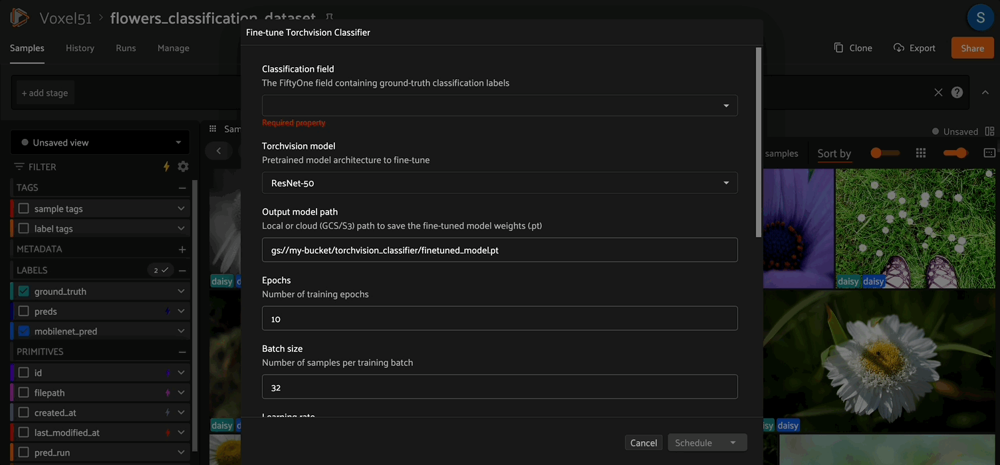

# torchvision-classifier-finetuner

A [FiftyOne plugin](https://docs.voxel51.com/plugins/index.html) with two operators: one to fine-tune a pretrained torchvision image classification model on any labeled FiftyOne dataset, and one to run inference with the saved checkpoint — all directly from the UI or Python API, no training boilerplate required.



## Overview

The plugin performs transfer learning on top of a pretrained image classification backbone. Given a FiftyOne dataset with a `Classification` label field, it will:

1. Discover all unique classes in the label field.
2. Auto-create an 80/20 train/val split (by tagging samples) if one doesn't already exist.
3. Load a pretrained torchvision model and replace the final classification head with one sized for your classes.
4. Train with AdamW + CosineAnnealingLR for the specified number of epochs, saving the best checkpoint by validation accuracy.
5. Export the checkpoint to a local path, GCS (`gs://…`), or S3 (`s3://…`).

The checkpoint is a `.pt` file containing the weights plus metadata (architecture name, class labels, image size) so it can be reloaded for inference without re-specifying those details.

The companion inference operator loads the checkpoint and writes `fo.Classification` predictions directly onto your dataset. Because predictions are stored as native FiftyOne labels, they immediately unlock [FiftyOne's model evaluation suite](https://docs.voxel51.com/user_guide/evaluation.html) — letting you compute per-class metrics, visualize confusion matrices, and sort/filter by confidence or correctness from the app.

**Supported architectures**

| `model_name` | Architecture |
|---|---|
| `resnet50` | ResNet-50 |
| `efficientnet_b2` | EfficientNet-B2 |
| `mobilenet_v3_large` | MobileNetV3-Large |

- Auto train/val split, configurable hyperparameters, and best-checkpoint saving
- Export to local, GCS, or S3 paths; inference loads from the same locations
- Pre-downloads cloud media before DataLoader construction so worker processes always hit local files
- Modular file layout: model building (`models.py`), data augmentation (`transforms.py`), and the training loop (`trainer.py`) are each in their own focused module

---

## Dataset requirements
- The specified `label_field` must contain `fo.Classification` labels.
- If your dataset already has `"train"` and `"val"` tags on samples, those splits will be used. Otherwise the plugin automatically tags 80% as `"train"` and 20% as `"val"`.

---

## Fine Tuning Operator

### From the FiftyOne UI

1. Open a dataset with a `Classification` label field.
2. Click the **Fine-tune Classifier** button in the Samples Grid secondary actions bar.
3. Fill in the input form and click **Schedule** to run the fine-tuning job as a delegated operator.

### From Python

```python
import fiftyone as fo
import fiftyone.operators as foo

dataset = fo.load_dataset("my_dataset")

op = foo.get_operator("@smehta73/torchvision-classifier-finetuner")
op.execute(
    fo.OperatorExecutionContext(
        dataset=dataset,
        params={
            "label_field": "ground_truth",
            "model_name": "resnet50",
            "export_uri": "/tmp/my_model.pt",
            "epochs": 15,
            "batch_size": 32,
            "learning_rate": 1e-4,
        },
    )
)
```

### Fine-tuner parameters

| Parameter | Type | Default | Description |
|-----------|------|---------|-------------|
| `label_field` | string | — | The `Classification` field on your dataset to train on |
| `model_name` | choice | `resnet50` | Backbone architecture (see supported models below) |
| `export_uri` | string | — | Output path for the `.pt` checkpoint (local, `gs://`, or `s3://`) |
| `epochs` | int | 10 | Number of training epochs |
| `batch_size` | int | 32 | Mini-batch size |
| `learning_rate` | float | 1e-4 | Initial learning rate for AdamW |
| `weight_decay` | float | 1e-4 | L2 regularization coefficient |
| `img_size` | int | 224 | Input image size (square, in pixels) |
| `num_workers` | int | 0 | DataLoader worker processes |
| `target_device_index` | int | 0 | CUDA GPU index (ignored if no GPU is present) |

---

## Inference operator

Once you have a fine-tuned checkpoint, use the **Run Torchvision Classifier Inference** operator to write predictions back to any FiftyOne view — without leaving the app.

### From the FiftyOne UI

1. Open the dataset (or any view/slice) you want to run inference on.
2. Click the **Run Torchvision Classifier Inference** button in the Samples Grid secondary actions bar.
3. Point the file picker at your `.pt` checkpoint (local or cloud path), set an output field name, and click **Execute**.

### From Python

```python
import fiftyone as fo
import fiftyone.operators as foo

dataset = fo.load_dataset("my_dataset")

op = foo.get_operator("@smehta73/torchvision-classifier-inference")
op.execute(
    fo.OperatorExecutionContext(
        dataset=dataset,
        params={
            "model_uri": {"absolute_path": "gs://my-bucket/torchvision_classifier/best.pt"},
            "label_field": "predicted_label",
            "batch_size": 64,
            "num_workers": 4,
        },
    )
)
```

### Inference parameters

| Parameter | Type | Default | Description |
|-----------|------|---------|-------------|
| `model_uri` | file | — | Path to the `.pt` checkpoint (local, `gs://`, or `s3://`) |
| `label_field` | string | `predicted_label` | Field name to write `fo.Classification` predictions into |
| `batch_size` | int | 64 | Images per inference batch |
| `num_workers` | int | 4 | DataLoader worker processes |
| `target_device_index` | int | 0 | CUDA GPU index (ignored on MPS/CPU) |

The checkpoint is self-contained — it stores the architecture name, class labels, and image size, so you never need to re-specify them at inference time.

---


## Customizing for your use case

The plugin is split into focused modules — each covering one concern. Edit only the file relevant to what you want to change:

| Goal | File to edit |
|---|---|
| Add a new backbone (ViT, ConvNeXt, etc.) | `models.py` |
| Change data augmentation | `transforms.py` |
| Swap loss function (label smoothing, focal loss) | `__init__.py` — one line in `execute()` |
| Swap optimizer or LR scheduler | `__init__.py` — one line in `execute()` |
| Change train/val split ratio or strategy | `__init__.py` — `execute()` split section |
| Change how samples are filtered or loaded | `dataset.py` |

### File responsibilities

- **`models.py`** — `build_model()` + `SUPPORTED_MODELS` dict. The UI dropdown auto-populates from `SUPPORTED_MODELS`, so adding a key here is all it takes to expose a new architecture.
- **`transforms.py`** — `get_transforms()`. Augmentation changes stay fully isolated from training logic.
- **`trainer.py`** — `train()` function. Accepts model, loaders, criterion, optimizer, scheduler, epochs, device, and ctx. Returns `best_val_acc` and `best_state`.
- **`dataset.py`** — `FiftyOneClassificationDataset`. Handles label filtering and mapping between FiftyOne sample IDs and integer class indices.
- **`__init__.py`** — Thin operator shell. `execute()` wires together the modules: discovers classes, handles the train/val split, builds dataloaders, constructs criterion/optimizer/scheduler, calls `trainer.train()`, and saves the checkpoint.

### Add a new model backbone

Edit `models.py`:

```python
# models.py
SUPPORTED_MODELS = {
    "resnet50": "ResNet-50",
    "efficientnet_b2": "EfficientNet-B2",
    "mobilenet_v3_large": "MobileNetV3-Large",
    "vit_b_16": "ViT-B/16",   # <-- add entry here
}

def build_model(model_name, num_classes, pretrained=True):
    ...
    if model_name == "vit_b_16":
        weights = models.ViT_B_16_Weights.DEFAULT if pretrained else None
        model = models.vit_b_16(weights=weights)
        in_features = model.heads.head.in_features
        model.heads.head = nn.Linear(in_features, num_classes)
        return model
    # ... existing branches below
```

### Change data augmentation

Edit `transforms.py`:

```python
def get_transforms(img_size, is_train):
    if is_train:
        return transforms.Compose([
            transforms.RandomResizedCrop(img_size),
            transforms.RandomHorizontalFlip(),
            transforms.RandAugment(),               # swap in RandAugment
            transforms.ToTensor(),
            transforms.Normalize(mean=[0.485, 0.456, 0.406],
                                 std=[0.229, 0.224, 0.225]),
        ])
```

### Change the loss function

In `execute()` in `__init__.py`:

```python
# e.g. label smoothing
criterion = nn.CrossEntropyLoss(label_smoothing=0.1)
```

### Change the optimizer or learning rate schedule

In `execute()` in `__init__.py`:

```python
# Example: switch to SGD with StepLR
optimizer = torch.optim.SGD(model.parameters(), lr=lr, momentum=0.9, weight_decay=wd)
scheduler = torch.optim.lr_scheduler.StepLR(optimizer, step_size=5, gamma=0.1)
```

### Freeze the backbone (linear-probe style)

In `execute()` in `__init__.py`, after `build_model()`:

```python
model = build_model(model_name, num_classes)
for name, param in model.named_parameters():
    if "fc" not in name and "classifier" not in name and "heads" not in name:
        param.requires_grad = False
```

### Change the train/val split ratio

In `execute()` in `__init__.py`:

```python
train_ratio = 0.8   # <-- adjust this
```

### Customize how samples are loaded

Edit the constructor loop in `dataset.py`:

```python
for sample in view.iter_samples():
    label_obj = sample.get_field(label_field)
    if label_obj is None or label_obj.label is None:
        continue
    # Example: skip samples with confidence below a threshold
    if label_obj.confidence is not None and label_obj.confidence < 0.9:
        continue
    label_str = label_obj.label
    if label_str in class_to_idx:
        self._label_map[sample.id] = class_to_idx[label_str]
```

---
## License

MIT
